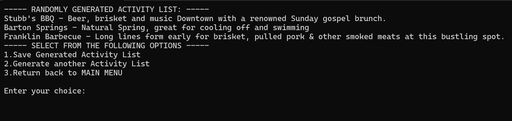

# SpAustintaneous App

An application for users to explore activities in Austin based on their interests.

## Description

SpAustintaneous is a console-based Java application designed to help users discover activities in Austin, Texas, based on their interests. Users can create an account, select their interest categories, and receive personalized activity recommendations. The app also allows users to save and view their activity lists.

## Getting Started

### Dependencies

* Java Development Kit (JDK) 8 or higher
* Apache Maven (optional, for building the project)
* A terminal or command-line interface
* An IDE such as IntelliJ IDEA or Eclipse (optional, for development)

### Executing program

* How to run the program:

* Step-by-step bullets
Welcome to our program! 
The initial screen will ask you to either create a new username or sign in if you are a returning user : 

After signing in , the program will show you the main menu as seen below. It is recommended to choosing the first option to select your interests if you are a new user before  using option 2, generating the recommended activity list. 

In option 3 you can see your personally saved interest categories and recommended activities. 

Below you can see example of a randomly generated activity list: 

## Authors

Jonathan Reyes

Clayton Yan

## Version History

* 0.1
   * Initial Release

## Acknowledgments